# Saigon Rider Reward Engine — Mermaid ERD (PostgreSQL)

- **대상 DBMS**: PostgreSQL 14+
- **시간 타입**: `timestamptz` (밀리초 정밀도, 타임존 보존)
- **JSON 타입**: `jsonb` (인덱싱·연산자 지원)
- **소수 타입**: `numeric`
- **v2.0 추가** (2026-05-18): 게이미피케이션 ENUM 7개 + 테이블 15개 + 기존 4테이블 ALTER

```mermaid
erDiagram
    SRE_USER ||--|| RP_BALANCE : holds
    SRE_USER ||--o{ RP_TRANSACTION : has
    SRE_USER ||--o{ ACTION_EVENT : produces
    SRE_USER ||--o{ USER_MISSION_PROGRESS : tracks
    SRE_USER ||--o{ MISSION_RECOMMENDATION : receives
    SRE_USER ||--o{ BEHAVIOR_CATEGORY_LOG : logs
    SRE_USER ||--|| USER_DIVERSITY_SCORE : has
    SRE_USER ||--|| USER_TIER : has
    SRE_USER ||--o{ REWARD_REDEMPTION : redeems
    SRE_USER ||--o{ ABUSE_EVENT : flagged
    SRE_USER ||--o{ RP_EXPIRATION_SCHEDULE : has

    ACTION_DEFINITION ||--o{ ACTION_EVENT : typed
    ACTION_DEFINITION ||--o{ MISSION_DEFINITION : referenced

    ACTION_EVENT ||--o{ RP_TRANSACTION : triggers
    ACTION_EVENT ||--o{ BEHAVIOR_CATEGORY_LOG : classified

    MISSION_DEFINITION ||--o{ USER_MISSION_PROGRESS : assigned
    MISSION_DEFINITION ||--o{ MISSION_RECOMMENDATION : suggests
    USER_MISSION_PROGRESS ||--o{ RP_TRANSACTION : awards

    RP_TRANSACTION ||--o{ AUDIT_LOG : audited
    RP_TRANSACTION ||--o{ RP_EXPIRATION_SCHEDULE : scheduled

    REWARD_PARTNER ||--o{ REWARD_CATALOG : supplies
    REWARD_CATALOG ||--o{ REWARD_REDEMPTION : ordered
    REWARD_REDEMPTION ||--|| RP_TRANSACTION : pays_with
    REWARD_REDEMPTION ||--o{ AUDIT_LOG : audited

    TIER_DEFINITION ||--o{ USER_TIER : defines
    USER_DIVERSITY_SCORE }o--|| USER_TIER : influences

    ABUSE_RULE ||--o{ ABUSE_EVENT : triggers
    ABUSE_EVENT ||--o{ AUDIT_LOG : audited

    IDEMPOTENCY_KEY ||--o| ACTION_EVENT : guards
    IDEMPOTENCY_KEY ||--o| REWARD_REDEMPTION : guards

    %% ── v2 게이미피케이션 관계 ──
    ITEM_COLLECTION ||--o{ ITEM_DEFINITION : contains
    ITEM_COLLECTION ||--o{ SEASON : themed
    ITEM_COLLECTION ||--o| LOOTBOX_DEFINITION : filters
    ITEM_COLLECTION ||--o| GACHA_DEFINITION : filters

    ITEM_DEFINITION ||--o{ USER_ITEM : owned
    ITEM_DEFINITION ||--o| USER_EQUIPMENT : equipped
    ITEM_DEFINITION ||--o{ LOOTBOX_DROP_LOG : dropped
    ITEM_DEFINITION ||--o{ ITEM_ACQUISITION_LOG : logged
    ITEM_DEFINITION ||--o{ DAILY_FEATURED_ITEM : featured
    ITEM_DEFINITION ||--o{ GACHA_PULL_LOG : pulled
    ITEM_DEFINITION ||--o{ SHOP_PURCHASE_LOG : purchased

    SRE_USER ||--o{ USER_ITEM : owns
    SRE_USER ||--o{ USER_EQUIPMENT : wears
    SRE_USER ||--o{ USER_SEASON_PASS : progresses
    SRE_USER ||--o{ USER_INVENTORY_BOX : holds
    SRE_USER ||--o{ LOOTBOX_DROP_LOG : opens
    SRE_USER ||--o{ ITEM_ACQUISITION_LOG : acquires
    SRE_USER ||--o{ USER_GACHA_PITY : tracks_pity
    SRE_USER ||--o{ GACHA_PULL_LOG : pulls
    SRE_USER ||--o{ SHOP_PURCHASE_LOG : buys

    SEASON ||--o{ USER_SEASON_PASS : enrolled

    LOOTBOX_DEFINITION ||--o{ USER_INVENTORY_BOX : granted
    USER_INVENTORY_BOX ||--o{ LOOTBOX_DROP_LOG : opened

    GACHA_DEFINITION ||--o{ USER_GACHA_PITY : counted
    GACHA_DEFINITION ||--o{ GACHA_PULL_LOG : recorded

    SRE_USER {
        bigint user_id PK
        varchar external_user_uuid UK
        account_type_enum account_type
        boolean is_driver_verified
        user_status_enum status
        timestamptz created_at
    }

    ACTION_DEFINITION {
        varchar action_code PK
        varchar category_code
        varchar display_name
        int base_rp
        int daily_count_limit
        boolean is_active
        jsonb metadata_schema
        timestamptz updated_at
    }

    ACTION_EVENT {
        bigint event_id PK
        bigint user_id FK
        varchar action_code FK
        timestamptz occurred_at
        jsonb payload
        varchar idempotency_key UK
        numeric calculated_rp
        numeric applied_multiplier
        event_status_enum process_status
        varchar reject_reason_code
        timestamptz created_at
    }

    MISSION_DEFINITION {
        bigint mission_id PK
        varchar mission_code UK
        varchar title
        varchar description
        varchar category_code
        jsonb target_rule
        int reward_rp "DEPRECATED: use reward_bundle.gp"
        jsonb reward_bundle "v2: GP/GC/SXP/items/boxes"
        int duration_hours
        boolean is_repeatable
        timestamptz starts_at
        timestamptz ends_at
        boolean is_active
    }

    USER_MISSION_PROGRESS {
        bigint progress_id PK
        bigint user_id FK
        bigint mission_id FK
        int current_value
        int target_value
        mission_status_enum status
        timestamptz started_at
        timestamptz completed_at
        timestamptz expires_at
        timestamptz reward_dispatched_at "v2: 보상 디스패치 완료 시각"
        jsonb reward_dispatch_log "v2: 디스패치 결과 상세"
    }

    MISSION_RECOMMENDATION {
        bigint rec_id PK
        bigint user_id FK
        bigint mission_id FK
        numeric score
        varchar reason_code
        timestamptz recommended_at
        timestamptz consumed_at
    }

    RP_BALANCE {
        bigint user_id PK,FK
        bigint current_balance
        bigint lifetime_earned
        bigint lifetime_spent
        bigint expiring_soon
        timestamptz last_recalculated_at
        bigint gc_balance "v2: GC 잔액"
        bigint lifetime_gc_earned "v2"
        bigint lifetime_gc_spent "v2"
    }

    RP_TRANSACTION {
        bigint transaction_id PK
        bigint user_id FK
        tx_type_enum tx_type
        bigint amount
        bigint balance_after
        varchar source_type
        bigint source_id
        bigint related_event_id FK
        timestamptz occurred_at
        timestamptz expires_at
        varchar memo
        varchar currency "v2: GP or GC"
    }

    RP_EXPIRATION_SCHEDULE {
        bigint expire_id PK
        bigint user_id FK
        bigint source_transaction_id FK
        bigint remaining_amount
        timestamptz expires_at
        expire_status_enum status
    }

    BEHAVIOR_CATEGORY_LOG {
        bigint log_id PK
        bigint user_id FK
        varchar category_code
        bigint related_event_id FK
        timestamptz occurred_at
        int month_key
    }

    USER_DIVERSITY_SCORE {
        bigint user_id PK,FK
        int month_key PK
        int active_category_count
        numeric multiplier
        timestamptz last_calculated_at
    }

    TIER_DEFINITION {
        varchar tier_code PK
        varchar tier_name
        bigint min_lifetime_rp
        int min_diversity_count
        int sort_order
    }

    USER_TIER {
        bigint user_id PK,FK
        varchar current_tier_code FK
        bigint progress_to_next
        timestamptz achieved_at
    }

    REWARD_PARTNER {
        bigint partner_id PK
        varchar partner_code UK
        varchar partner_name
        integration_type_enum integration_type
        jsonb api_config
        boolean is_active
        timestamptz created_at
    }

    REWARD_CATALOG {
        bigint catalog_id PK
        bigint partner_id FK
        varchar item_code UK
        varchar item_name
        varchar category_code
        int required_rp
        int face_value_vnd
        int monthly_quota
        int monthly_issued
        boolean is_active
        timestamptz visible_from
        timestamptz visible_until
    }

    REWARD_REDEMPTION {
        bigint redemption_id PK
        bigint user_id FK
        bigint catalog_id FK
        bigint rp_transaction_id FK
        redemption_status_enum status
        varchar voucher_code
        jsonb external_response
        varchar idempotency_key UK
        timestamptz requested_at
        timestamptz fulfilled_at
        timestamptz expires_at
    }

    ABUSE_RULE {
        varchar rule_code PK
        varchar rule_name
        abuse_severity_enum severity
        jsonb condition_json
        abuse_action_enum action
        boolean is_active
    }

    ABUSE_EVENT {
        bigint abuse_event_id PK
        bigint user_id FK
        varchar rule_code FK
        bigint related_event_id FK
        jsonb detail
        abuse_action_enum action_taken
        timestamptz detected_at
    }

    IDEMPOTENCY_KEY {
        varchar idempotency_key PK
        varchar resource_type
        bigint resource_id
        timestamptz created_at
        timestamptz expires_at
    }

    AUDIT_LOG {
        bigint audit_id PK
        varchar entity_type
        bigint entity_id
        bigint actor_user_id
        varchar action_code
        jsonb before_snapshot
        jsonb after_snapshot
        timestamptz created_at
    }

    %% ── v2 게이미피케이션 엔티티 (15개) ──

    ITEM_COLLECTION {
        varchar collection_code PK
        varchar display_name
        varchar theme_color_hex
        collection_status_enum status
        int sort_order
        timestamptz created_at
    }

    ITEM_DEFINITION {
        varchar item_code PK
        varchar display_name
        item_slot_enum slot
        item_rarity_enum rarity
        varchar collection_code FK
        int shop_price_gp
        int shop_price_gc
        boolean is_shop_visible
        boolean season_lock
        varchar required_season_code
        varchar asset_uri
        timestamptz created_at
    }

    USER_ITEM {
        bigint user_item_id PK
        bigint user_id FK
        varchar item_code FK
        timestamptz acquired_at
        acquisition_source_enum acquisition_source
        bigint source_ref_id
    }

    USER_EQUIPMENT {
        bigint user_id PK,FK
        item_slot_enum slot PK
        varchar item_code FK
        timestamptz equipped_at
    }

    SEASON {
        varchar season_code PK
        varchar display_name
        varchar collection_code FK
        timestamptz starts_at
        timestamptz ends_at
        season_status_enum status
        int max_level
        int sxp_per_level
        int daily_sxp_cap
        timestamptz created_at
    }

    USER_SEASON_PASS {
        bigint user_id PK,FK
        varchar season_code PK,FK
        int sxp_balance
        int current_level
        boolean has_premium
        timestamptz premium_granted_at
        int_array claimed_levels
        int daily_sxp_today
        date daily_sxp_date
    }

    LOOTBOX_DEFINITION {
        varchar box_code PK
        varchar display_name
        varchar collection_filter FK
        jsonb drop_table
        boolean expires_with_season
        varchar required_season_code
        boolean auto_open_on_grant
        timestamptz created_at
    }

    USER_INVENTORY_BOX {
        bigint inventory_box_id PK
        bigint user_id FK
        varchar box_code FK
        timestamptz granted_at
        acquisition_source_enum granted_source
        bigint granted_source_ref
        timestamptz opened_at
        box_status_enum status
    }

    LOOTBOX_DROP_LOG {
        bigint drop_log_id PK
        bigint inventory_box_id FK
        bigint user_id FK
        varchar box_code FK
        varchar dropped_item_code FK
        boolean was_duplicate
        varchar refund_currency
        int refund_amount
        varchar random_seed
        timestamptz opened_at
    }

    ITEM_ACQUISITION_LOG {
        bigint log_id PK
        bigint user_id FK
        varchar item_code FK
        acquisition_source_enum acquisition_source
        bigint source_ref_id
        varchar granted_or_refunded
        varchar refund_currency
        int refund_amount
        timestamptz occurred_at
    }

    GACHA_DEFINITION {
        varchar gacha_code PK
        varchar display_name
        varchar description
        varchar cost_currency
        int cost_per_pull
        int cost_per_10_pull
        varchar collection_filter FK
        jsonb drop_table
        int pity_threshold
        item_rarity_enum pity_guarantee_rarity
        boolean pity_resets_with_season
        timestamptz starts_at
        timestamptz ends_at
        varchar required_season_code
        gacha_status_enum status
        boolean is_listed
        int sort_order
        timestamptz created_at
    }

    USER_GACHA_PITY {
        bigint user_id PK,FK
        varchar gacha_code PK,FK
        int pity_count
        bigint total_pulls
        timestamptz last_pull_at
        varchar season_scope
    }

    GACHA_PULL_LOG {
        bigint pull_log_id PK
        bigint user_id FK
        varchar gacha_code FK
        bigint batch_id
        boolean is_10_pull
        int pull_index
        varchar cost_currency
        int cost_amount
        item_rarity_enum picked_rarity
        varchar picked_item_code FK
        boolean was_duplicate
        varchar refund_currency
        int refund_amount
        boolean was_pity_hit
        boolean was_10pull_guarantee
        int pity_count_before
        int pity_count_after
        varchar random_seed
        timestamptz pulled_at
    }

    DAILY_FEATURED_ITEM {
        date featured_date PK
        varchar item_code PK,FK
        int discount_pct
        int sort_order
        timestamptz created_at
    }

    SHOP_PURCHASE_LOG {
        bigint purchase_log_id PK
        bigint user_id FK
        varchar item_code FK
        varchar cost_currency
        int base_price
        int discount_pct
        int cost_amount
        boolean was_featured
        bigint user_item_id
        timestamptz purchased_at
    }
```

## PostgreSQL ENUM 타입

DDL에서 정의한 ENUM 타입은 다음과 같이 매핑됩니다.

| ENUM 타입 | 사용 컬럼 | 값 |
|---|---|---|
| `account_type_enum` | `sre_user.account_type` | `STANDARD`, `DRIVER`, `BUSINESS` |
| `user_status_enum` | `sre_user.status` | `ACTIVE`, `SUSPENDED`, `DELETED` |
| `event_status_enum` | `action_event.process_status` | `PENDING`, `PROCESSED`, `REJECTED`, `REFUNDED` |
| `mission_status_enum` | `user_mission_progress.status` | `ACTIVE`, `COMPLETED`, `EXPIRED`, `CANCELLED` |
| `tx_type_enum` | `rp_transaction.tx_type` | `EARN`, `REDEEM`, `EXPIRE`, `ADJUST_PLUS`, `ADJUST_MINUS`, `REFUND` |
| `expire_status_enum` | `rp_expiration_schedule.status` | `PENDING`, `PARTIALLY_USED`, `EXPIRED`, `FULLY_USED` |
| `integration_type_enum` | `reward_partner.integration_type` | `INTERNAL`, `GOTIT`, `URBOX`, `TELCO`, `MANUAL` |
| `redemption_status_enum` | `reward_redemption.status` | `REQUESTED`, `FULFILLED`, `FAILED`, `REFUNDED`, `CANCELLED` |
| `abuse_severity_enum` | `abuse_rule.severity` | `LOW`, `MEDIUM`, `HIGH`, `CRITICAL` |
| `abuse_action_enum` | `abuse_rule.action`, `abuse_event.action_taken` | `LOG`, `REDUCE`, `REJECT`, `SUSPEND` |
| `collection_status_enum` | `item_collection.status` | `ACTIVE`, `RETIRED`, `UPCOMING` |
| `item_slot_enum` | `item_definition.slot`, `user_equipment.slot` | `HELMET`, `JACKET`, `GLOVES`, `BOOTS`, `EYEWEAR`, `NAMEPLATE`, `BODY_PAINT`, `WHEEL`, `EXHAUST`, `HEADLIGHT`, `MIRROR`, `DECAL`, `NUMBER`, `FRAME`, `BACKDROP`, `TITLE`, `TRAIL`, `HORN`, `START_ANIM` |
| `item_rarity_enum` | `item_definition.rarity`, `gacha_pull_log.picked_rarity`, `gacha_definition.pity_guarantee_rarity` | `C`, `R`, `E`, `L`, `M` |
| `acquisition_source_enum` | `user_item.acquisition_source`, `user_inventory_box.granted_source`, `item_acquisition_log.acquisition_source` | `MISSION`, `SEASON_PASS`, `SHOP`, `LOOTBOX`, `TIER_REWARD`, `REFERRAL`, `EVENT`, `ADMIN_GRANT` |
| `season_status_enum` | `season.status` | `UPCOMING`, `ACTIVE`, `ENDED` |
| `box_status_enum` | `user_inventory_box.status` | `UNOPENED`, `OPENED`, `EXPIRED` |
| `gacha_status_enum` | `gacha_definition.status` | `UPCOMING`, `ACTIVE`, `ENDED` |

## 도메인 그룹 색깔 가이드 (시각화 시 참고)

- 🟦 **사용자 식별**: SRE_USER
- 🟩 **이벤트 / 행동**: ACTION_DEFINITION, ACTION_EVENT, BEHAVIOR_CATEGORY_LOG
- 🟨 **미션**: MISSION_DEFINITION, USER_MISSION_PROGRESS, MISSION_RECOMMENDATION
- 🟧 **포인트 원장**: RP_BALANCE, RP_TRANSACTION, RP_EXPIRATION_SCHEDULE
- 🟪 **다양성 / 등급**: USER_DIVERSITY_SCORE, TIER_DEFINITION, USER_TIER
- 🟥 **보상**: REWARD_PARTNER, REWARD_CATALOG, REWARD_REDEMPTION
- ⬛ **보안 / 감사**: ABUSE_RULE, ABUSE_EVENT, IDEMPOTENCY_KEY, AUDIT_LOG
- 🟫 **v2 아이템 / 컬렉션**: ITEM_COLLECTION, ITEM_DEFINITION, USER_ITEM, USER_EQUIPMENT, ITEM_ACQUISITION_LOG
- 🟤 **v2 시즌**: SEASON, USER_SEASON_PASS
- 🔶 **v2 박스**: LOOTBOX_DEFINITION, USER_INVENTORY_BOX, LOOTBOX_DROP_LOG
- 💎 **v2 가챠 / 상점**: GACHA_DEFINITION, USER_GACHA_PITY, GACHA_PULL_LOG, DAILY_FEATURED_ITEM, SHOP_PURCHASE_LOG

## 변경 요약 (MySQL → PostgreSQL)

| MySQL | PostgreSQL | 비고 |
|---|---|---|
| `datetime` | `timestamptz` | 타임존 보존이 필요 없으면 `timestamp`도 가능 |
| `json` | `jsonb` | 인덱싱·연산자 지원 |
| `decimal` | `numeric` | PostgreSQL 표준 명칭 |
| `enum` (인라인) | 명명된 ENUM 타입 | DDL 상단에서 `CREATE TYPE`으로 정의 후 재사용 |
| `abuse_rule.condition` | `abuse_rule.condition_json` | DDL 실제 컬럼명과 일치 |
